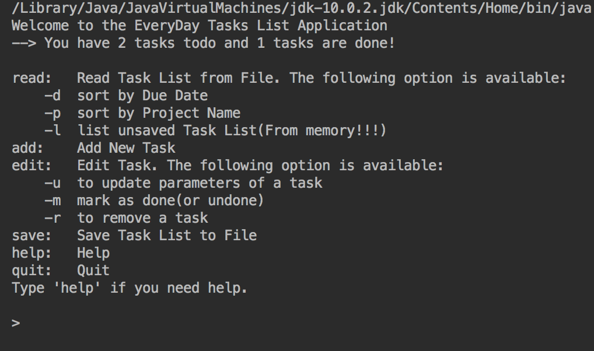
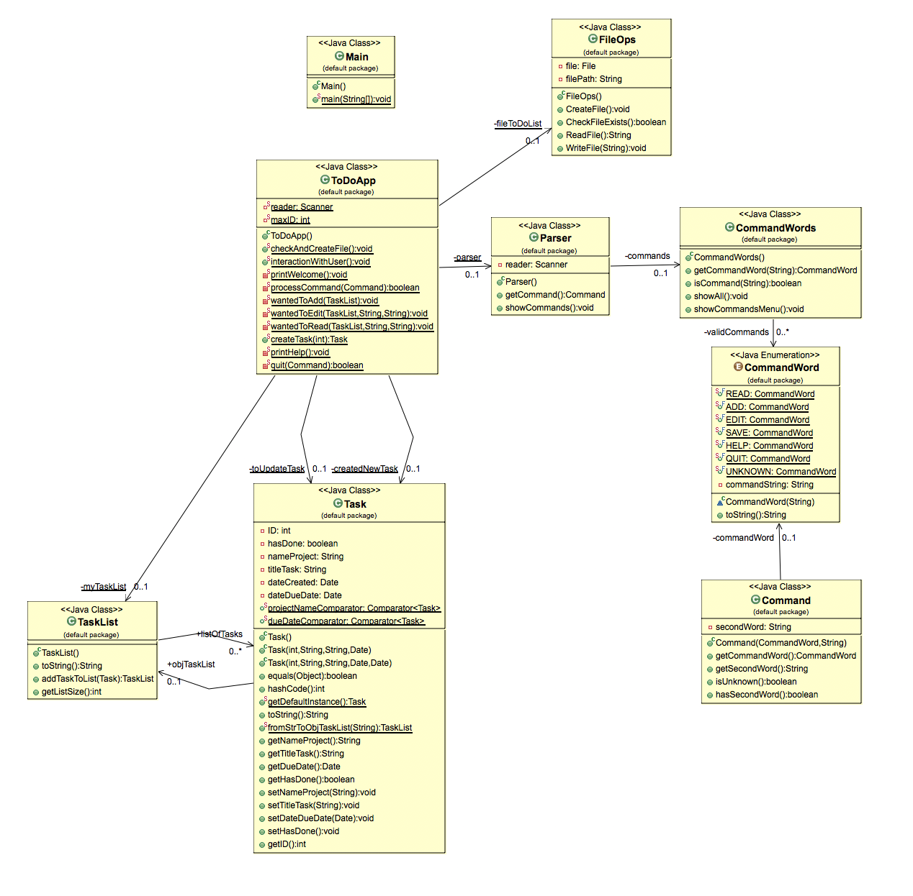

# Java-TodoList-Console-App
Java ToDoList Application as an IP 
#### @version v1.0

The application allows a user to create new tasks, assign them a title and due date, and choose a project for that task to belong to. 

## Getting Started

The tasks can be listed, sorted, edited, marked as done or removed from the list. The user can save or quit without saving the current task list.

It has a text based user interface via the command-line. It uses a text file to store the data.

## User Manual

* This might be clear enough :) Isn't it?:

##### List tasks
'read'     -> Read Task List from File. The following option is available:
'read -d'	 -> sort by Due Date
'read	-p'	 -> sort by Project Name
'read	-l'	 -> list unsaved Task List(From memory!!!)

##### Add new task to list
'add'      -> Add New Task

##### Edit Task. The following option is available:
'edit'     -> (Not workes alone. There should be a parameter!)
	-u	to update parameters of a task
	-m	mark as done(or undone)
	-r	to remove a task
##### Save tasks to file
'save'     -> Save Task List to File
##### Help (Shows Main Menu)
'help'     -> Help
##### Quit without saving
'quit'     -> Quit
Type 'help' if you need help.

## Class Diagram

## Authors

* **Adem Sezer** - *Initial work* - [adam2adam](https://github.com/adam2adam)
